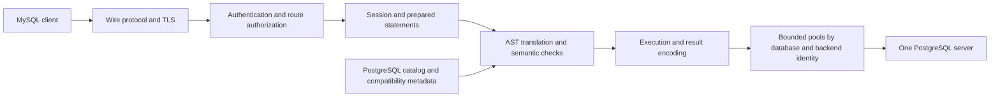

# Architecture contract

This document specifies the target for 0.1.0. It is not a claim of implemented
support; evidence is tracked in [the release plan](release-plan.md).

## Request path



## Routing and identity

Configuration has four distinct concepts:

1. One PostgreSQL endpoint and verified TLS settings.
2. Logical database aliases, each mapping to an exact physical database and
   schema. For example, `shop → shop.public`, `sales → company.sales`,
   `reporting → company.reporting`.
3. Backend credential profiles identifying PostgreSQL login roles. Secrets are
   loaded through explicit environment/file references and never serialized
   through `Debug`, diagnostics, errors or ordinary logs.
4. MySQL principals with credential verifiers, a backend profile, an allowlist
   of aliases and an optional authorized default alias.

Unknown settings, duplicate aliases, empty grants, unresolved references,
reserved schemas and unauthorized defaults are configuration errors. A physical
database name is never an implicitly authorized alias. SQL cannot elevate a
principal or select arbitrary backend credentials.

The same route resolution and authorization apply at handshake, `USE`,
`COM_INIT_DB`, `COM_CHANGE_USER`, qualified object references, metadata commands,
and prepare/execute/reset transitions. `SHOW DATABASES` exposes only authorized
aliases. Changing user clears all prior state and authenticates anew. Resetting
a connection preserves its authenticated identity but clears session state.

Qualified references to multiple aliases are valid only when all are authorized,
use the same physical database and compatible backend identity, and the
statement can execute atomically on one connection. Reject unsupported
cross-database statements before executing any part of them. Never rewrite an
unknown qualifier to the default schema.

PostgreSQL grants and row-level security remain authoritative. Use the mapped
role directly; a privileged shared service role with ad hoc `SET ROLE` is not
the default design.

## Initialization and commands

Target commands:

```text
darmok config check --config darmok.toml
darmok init --database-url-env DARMOK_ADMIN_DATABASE_URL
darmok schema verify --database-url-env DARMOK_ADMIN_DATABASE_URL
darmok doctor --config darmok.toml
darmok serve --config darmok.toml
darmok --version
```

`init` creates compatibility functions and metadata in the reserved `darmok`
schema once per physical database, under explicit administrative credentials.
It does not create, infer or repair application objects. The installation is
serialized and transactional where PostgreSQL permits, versioned, and
idempotent only when the existing installation matches. A name conflict,
unexpected object, partial installation, or incompatible version is an error.
No automatic destructive repair or pre-release migration framework is added.

`schema verify` checks an existing installation in one explicitly selected
physical database without creating or repairing objects. This command is
deliberately independent of the future logical route graph: setup operators can
verify a database before configuring the serving proxy. It is not a substitute
for `doctor` or runtime admission. `init`, `schema verify`, help and version are
implemented by the [CLI component](cli.md); the other commands remain pending.

Runtime roles receive only the grants they need. Fully qualify helper
references, constrain any privileged function's `search_path`, revoke unsafe
default public grants, and avoid runtime superuser credentials. `serve` verifies
the installation and never installs it. `doctor` reports actionable checks
without changing database state or printing secrets.

## Authentication and wire capabilities

The intended frontend authentication method is `caching_sha2_password` over
TLS. Test the complete cold and cached authentication exchanges with real
clients, including wrong credentials, malformed messages, and reconnects.
Do not claim support based only on scramble helper tests. Any additional auth
method is explicit and separately tested.

Advertise only implemented protocol capabilities. Fragmentation, sequence
numbers, result terminators, affected rows, insert IDs, warning/status flags,
parameter types, NULLs and result metadata are part of the wire contract.
Unsupported cursor, long-data, multi-statement or other modes get deliberate
protocol errors; they must not be partially executed or silently downgraded.

## Sessions, execution and pooling

Separate wire/session state from translation, catalog lookup and execution.
Transactions, temporary objects, advisory locks, prepared statements and open
streams have explicit connection ownership. Backend pool identity includes the
physical database and credentials; route schema and session settings are
established safely before execution.

Bound total and per-pool connections, waiting requests, query time, packet size,
prepared statements, parameter bytes, cache memory and shutdown time. Close or
reset uncertain connections before reuse. Cancellation must stop backend work,
finish or abandon protocol output coherently, and release owned resources.
Never return a dirty, failed or unverified connection to another session.

Represent MySQL statement errors and transaction semantics explicitly rather
than inheriting PostgreSQL's aborted-transaction behavior accidentally. Verify
savepoints, autocommit transitions, DDL implicit commits, disconnect rollback,
locks and multi-step emulations. A translation that needs several backend
statements must define atomicity and failure behavior for every step.

The [statement execution contract](native-execution.md) specifies the
streaming/encoding boundary and completion states. The [native control owner](native-backend.md)
implements exclusive connection ownership and borrowed control scopes; the
admitted row executor is pending. Native type or control checks alone cannot
approve a statement or certify this execution path.

## Catalog and cache correctness

PostgreSQL catalogs are authoritative for native objects. Supplemental metadata
records only facts the proxy actually establishes and cannot infer reliably
from PostgreSQL. Do not invent MySQL column attributes for native objects.
Preserve case-sensitive quoted names. Reject unsupported native types with
precise diagnostics instead of converting arbitrary values to strings.

Cache keys account for physical database, schema, backend identity, logical
route, SQL mode, charset/collation, time zone, parameter shape, schema
dependencies and compatibility installation version. Prepared statements have
the same validity requirements as text queries.

External DDL, missed notifications, listener reconnects, transactional DDL,
temporary object shadowing, dropped/recreated objects and concurrent execution
must not produce stale translations or wire metadata. `LISTEN/NOTIFY` alone is
not a durable invalidation protocol. The implementation must choose and verify
a durable generation/locking design or catalog validation design before
enabling reusable catalog-dependent plans. Measure the extra round trips and
lock contention. Do not silently select weaker behavior when required
privileges or infrastructure are missing.

A project-owned PostgreSQL extension is permitted when a verified correctness
mechanism requires it. The user approved this installation option; it is not a
claim that an extension already resolves catalog validity or MySQL lock/snapshot
semantics. Any selected extension must have explicit installation/version checks,
a correctness argument and ordinary PostgreSQL17/18 evidence, including its
round-trip and contention costs. Its server packages become part of the
self-contained artifact gate. Unrestricted plugin loading remains outside the
first release. Security-related extension work remains deferred.

The [server catalog mechanism](server-catalog-lease.md) supplies catalog
generation/publication and [one-shot discovery](catalog-discovery.md) through
the exclusive native owner. It uses a separate `darmok_server` namespace
for native mechanisms and keeps SQL compatibility functions in `darmok`.
The primary-server target supports concurrent native two-phase transactions.
Discovery uses short internal Share spans and ends them before cleanup/output;
returned facts and stamps are historical observations, without execution leases.
Snapshot neutrality depends on its continuous private-owner backend profile.
Complete native dependency guards must be acquired outside Share, rechecked
against fresh metadata and retained through row execution. MySQL prepared
statements remain a separate planned protocol feature. Combined explicit
initialization/verification, supported preparation, semantic/cache admission
and table execution remain required; observation alone does not close the
catalog validity gate.

## Observability

Expose bounded-cardinality metrics for request outcomes, queue time, backend
latency, cache outcomes, pool use, cancellation and rejected capabilities.
Default logs contain statement categories, durations and error codes, without
credentials, SQL literals or parameter values. Detailed query logging is an
explicit operator choice with documented consequences.
